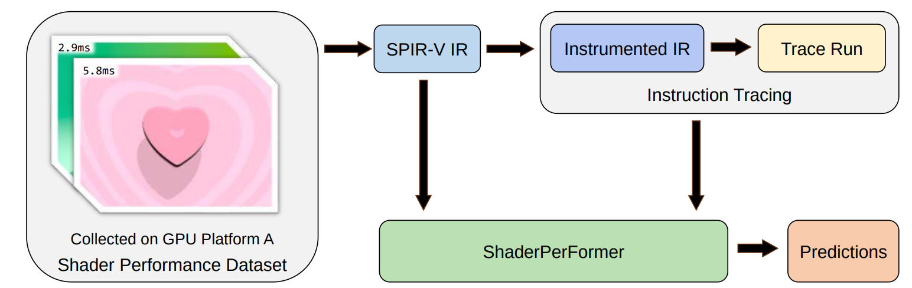

# ShaderPerFormer

Repository for our [ACM SIGGRAPH i3D'2024](https://i3dsymposium.org/2024/) paper: *ShaderPerFormer: Platform-independent Context-aware Shader Performance Predictor*.



Authors:
- Zitan Liu ([@libreliu](https://github.com/libreliu))
- Yikai Huang ([@Giluir](https://github.com/Giluir))
- Ligang Liu ([Homepage](http://staff.ustc.edu.cn/~lgliu)).

Useful links:
- [Author's version](./ShaderPerFormer.pdf)
- [Proc. ACMCGIT version](https://doi.org/10.1145/3651295)
- [Short video clip on pipeline of our work](./I3D-Video-HiRes.mp4)

<details>
<summary>BibTeX command for citation</summary>

```bibtex
@article{10.1145/3651295,
author = {Liu, Zitan and Huang, Yikai and Liu, Ligang},
title = {ShaderPerFormer: Platform-independent Context-aware Shader Performance Predictor},
year = {2024},
issue_date = {May 2024},
publisher = {Association for Computing Machinery},
address = {New York, NY, USA},
volume = {7},
number = {1},
url = {https://doi.org/10.1145/3651295},
doi = {10.1145/3651295},
abstract = {The ability to model and predict the execution time of GPU computations is crucial for real-time graphics application development and optimization. While there are many existing methodologies for graphics programmers to provide such estimates, those methods are often vendor-dependent, require the platforms to be tested, or fail to capture the contextual influences among shader instructions. To address this challenge, we propose ShaderPerFormer, a platform-independent, context-aware deep-learning approach to model GPU performance and provide end-to-end performance predictions on a per-shader basis. To provide more accurate predictions, our method contains a separate stage to gather platform-independent shader program trace information. We also provide a dataset consisting of a total of 54,667 fragment shader performance samples on 5 different platforms. Compared to the PILR and SH baseline methods, our approach reduces the average MAPE across five platforms by 8.26\% and 25.25\%, respectively.},
journal = {Proc. ACM Comput. Graph. Interact. Tech.},
month = {may},
articleno = {2},
numpages = {17},
keywords = {GPU, performance modeling, shader performance prediction}
}
```

</details>

> TODO:
> - [ ] Upload model & intermediate files
> - [ ] vkPredict notebook clean-up
> - [ ] More instructions on vkToy
> - [ ] Code tidy-up

> TODO:
> - [ ] Upload model & intermediate files
> - [ ] vkPredict notebook clean-up
> - [ ] More instructions on vkToy
> - [ ] Code tidy-up

## Contents

### Codes

`code/` contains the code for our paper.

### Datasets

`dataset/` contains the dataset collected for our paper.

### Trained Models

`trained/` contains models trained in our paper.

## Getting Started

First, be sure to read our paper to know the bigger picture. Below are guides helpful for reproducing our paper and analyse your shaders.

### Install Python package dependencies

The following might be a good start: `pip install -r requirements.txt` **OR** the following

```bash
pip install accelerate==0.25.0  \
huggingface-hub==0.19.4  \
nvidia-cublas-cu12==12.1.3.1  \
nvidia-cuda-cupti-cu12==12.1.105  \
nvidia-cuda-nvrtc-cu12==12.1.105  \
nvidia-cuda-runtime-cu12==12.1.105  \
nvidia-cudnn-cu12==8.9.2.26  \
nvidia-cufft-cu12==11.0.2.54  \
nvidia-curand-cu12==10.3.2.106  \
nvidia-cusolver-cu12==11.4.5.107  \
nvidia-cusparse-cu12==12.1.0.106  \
nvidia-nccl-cu12==2.18.1  \
nvidia-nvjitlink-cu12==12.3.101  \
nvidia-nvtx-cu12==12.1.105  \
peewee==3.17.0  \
regex==2023.10.3  \
tokenizers==0.15.0  \
torch==2.1.1  \
torch-tb-profiler==0.4.3  \
torchinfo==1.8.0  \
transformers==4.35.2  \
triton==2.1.0  \
xformers==0.0.23
```

### Compile and install vkExecute

Please refer to [code/vkExecute/README.md](code/vkExecute/README.md) for more information.

### Retrieve shaders

If you want to reproduce our paper, you can choose to extract from our snapshot (link is available inside [dataset/README.md](dataset/README.md)) on the shaders we gather from the website at around Feb. 2023.

Otherwise, you can make your own. Rough steps below:

1. Register account on [Shadertoy.com](https://www.shadertoy.com) and apply for an api key
2. Put the key into `code/toyDb/apiKey.txt`
3. `cd toyDb && python getShaders.py --amend noop`

After using this, you can check `python getShaders.py imageonly-shaders` to see how many image only shaders are gathered. The [toyDb README.md](code/toyDb/README.md) provides further hints on the formats of Shadertoy website APIs.

### Run measurements on target machine

You can measure the performance of the collections of shaders running on your machine by using the following command:

```bash
# An example command setting the iTime parameter to 7 and iFrame parameter to 420
# and using 10 number of trails (refer to our paper for what num_trials and num_cycles exactly means)
#
# Other parameters are specified in the default options.
python manage.py run --iTime 7 --iFrame 420 --comment YOU_CAN_ADDITIONALLY_PUT_COMMENT_HERE --num-trials 10 --save-images --database-file ${REPO_ROOT}/dataset/experiments.db 2> measurement_log.log

# This will run the "Instruction Tracing" stage for all runs in environment with ID=1
python manage.py trace --save-images --environment-id 1 --database-file ${REPO_ROOT}/dataset/experiments.db 2> trace_log.log
```

Locking the GPU frequency will help in measuring performance, see [toyDb README.md](code/toyDb/README.md) for more information.

You can also download our data (which is a SQLite database file `experiments.db`) used in the paper. See [dataset/README.md](dataset/README.md) for more information.

### Export measurements (& train/test/val splitting) for use in training / evaluation

1. `cd code/ && pip install --editable .`

   > Previously, `vkPredict` requires functionalities inside `toyDb` to access the `experiments.db` file, and we had put toyDb under `code/vkPredict` before in our original repo. This is a nice walkaround to not changing our original code too much while alleviating the need to manually manipulate the `PYTHONPATH`.

2. Do exporting as in `code/vkPredict/notebooks/production/DatasetSnapshotsValTimeFiltered.ipynb`.

   Fork your own for your new data. Also, do read the implementations of those filters before you edit.

You can also download our data (which is a series of `.dat` files in `dataset/intermediates/`) used in the paper. See [dataset/README.md](dataset/README.md) for more information.

### Train the ShaderPerformer model

See [vkPredict README.md](code/vkPredict/README.md) for more info.

You can also download our model trained in the paper. See [dataset/README.md](dataset/README.md) for more information.

### Test on trained models

Refer to [CustomTester.ipynb](code/vkPredict/notebooks/CustomTester.ipynb) and [validate.py](code/vkPredict/validate.py) for more info.

### Baseline methods

Refer to [BaselineMethodsValTimeFiltered.ipynb](code/vkPredict/notebooks/production/BaselineMethodsValTimeFiltered.ipynb) for more info.

This includes *Simple Heuristics* and *Per-Inst Linear Regression* as is described in the paper.

### vkToy: interactive shader editor and performance predictor

See code/vkToy for more info.

### Extra

> The `code/*/notebooks` contains some useful information on analyzing and experimenting.
>
> However, some attempts have failed and doesn't land into our eventual proposed method (e.g. simple augmentation, contrastive learning, MLM pretraining)
> 
> Also be aware of any potential path and import issues.

## Limitations

While we believe our method is generalizable, currently only **fragment shaders** with **image pass only** (=single pass) and **uniform block input only** (i.e. no texture read / write) inputs are supported in this work.

## Licenses

- Works by us: Licensed under MIT license.
- Third-party: Licenses may vary.
- Shadertoy: Shadertoy shaders have their respective licenses, for detail please refer to their own licenses.